# Waste Sorting Application API Documentation
Welcome to the API documentation for the Waste Sorting Application developed by Lebele Thabang Admore. 
This documentation provides comprehensive details on the REST endpoints necessary for effective communication
 between the frontend and backend systems of the application.
 
# Introduction
The  Waste Sorting Application serves as an educational tool, empowering individuals and communities to 
adopt environmentally conscious waste disposal practices. Through this API, users can access
 information on waste categories, disposal guidelines, and recycling tips. The endpoints outlined below
 facilitate seamless data exchange, enabling users to interact with the application effortlessly.

## Categories Endpoints

#### Add Category
Endpoint: http://localhost:8080/api/v1/categories
- **Method**: POST
- **Description**: Add a new waste category.
- **Response**:
  - **Status Code**: 200 OK
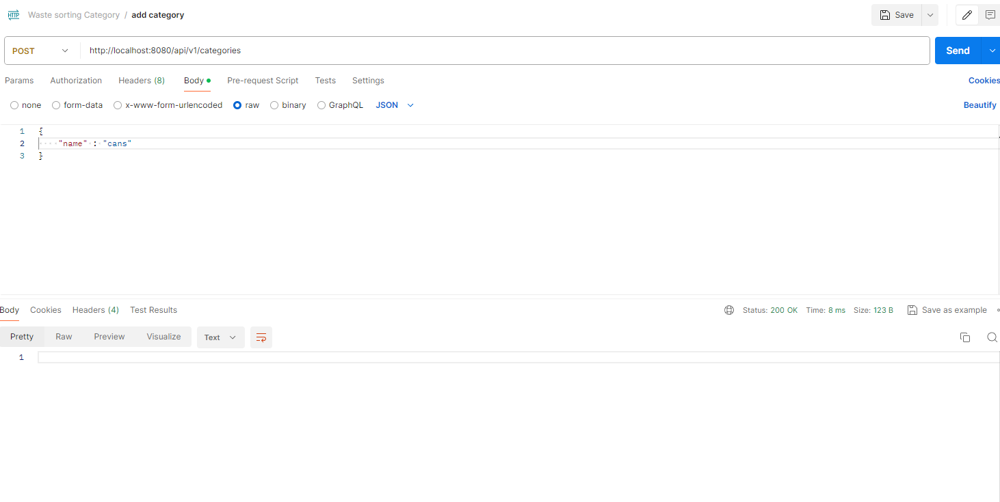

#### List All Categories
Endpoint: http://localhost:8080/api/v1/categories
- **Method**: GET
- **Description**: Retrieve all available waste categories.
- **Response**:
  - **Status Code**: 200 OK
    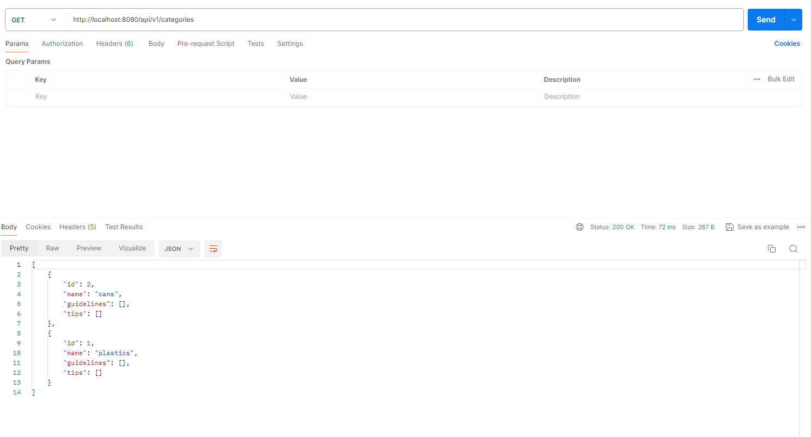
	
#### Get Category by ID
Endpoint: http://localhost:8080/api/v1/categories/{id}/category
- **Method**: GET
- **Description**:Retrieve a waste category by its ID.
- **Response**:
  - **Status Code**: 200 OK

    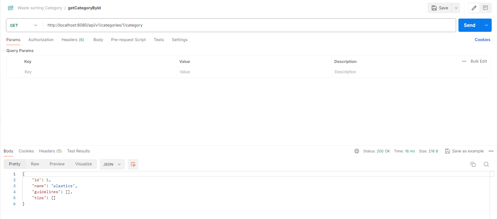
	
#### Get Category by Name
Endpoint: http://localhost:8080/api/v1/categories/{name}
- **Method**: GET
- **Description**: Retrieve a waste category by its name.
- **Response**:
  - **Status Code**: 200 OK

    

#### Update Category
Endpoint: http://localhost:8080/api/v1/categories/{id}
- **Method**: PUT
- **Description**:Update a waste category by its ID.
- **Response**:
  - **Status Code**: 200 OK

    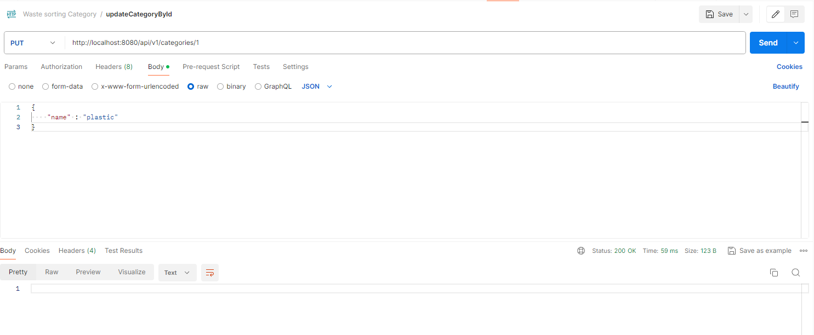	
	
#### Delete Category
Endpoint: http://localhost:8080/api/v1/categories/{id}
- **Method**: DELETE
- **Description**:Delete a waste category by its ID.
- **Response**:

    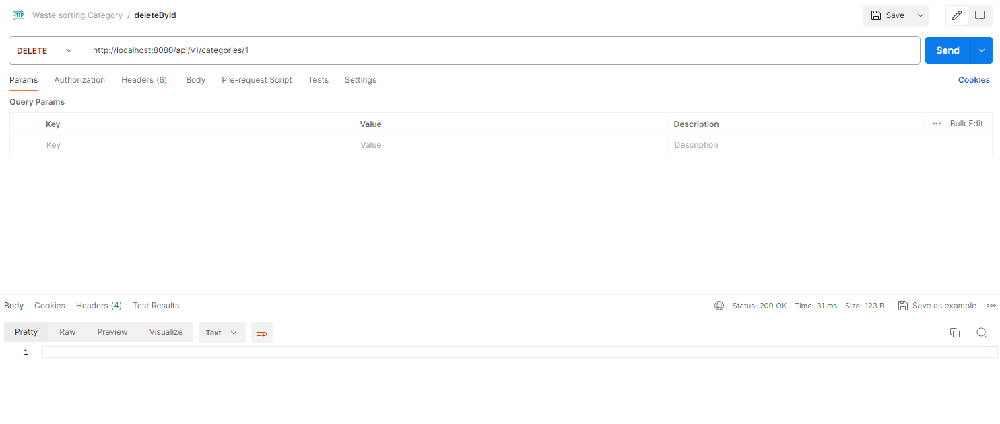	
	

## Guidelines Endpoints

#### Add Guideline
Endpoint: http://localhost:8080/api/v1/guidelines/{id}
- **Method**: POST
- **Description**:Add a new disposal guideline.
- **Response**:
  - **Status Code**: 200 OK

    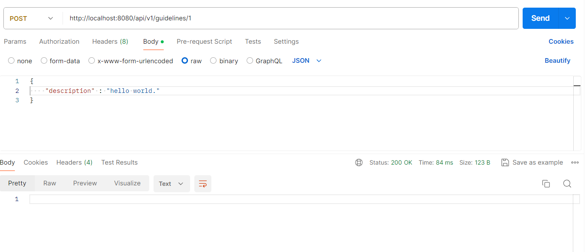

#### List all Guidelines
Endpoint: http://localhost:8080/api/v1/guidelines
- **Method**: GET
- **Description**: Retrieve all disposal guidelines.
- **Response**:
  - **Status Code**: 200 OK

    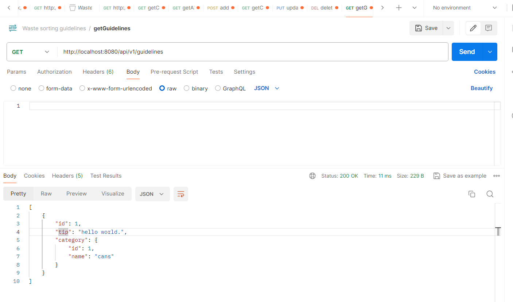
	
#### Get Guideline by ID
Endpoint: http://localhost:8080/api/v1/guidelines/{id}
- **Method**: GET
- **Description**:Retrieve a disposal guideline by its ID.
- **Response**:
  - **Status Code**: 200 OK

    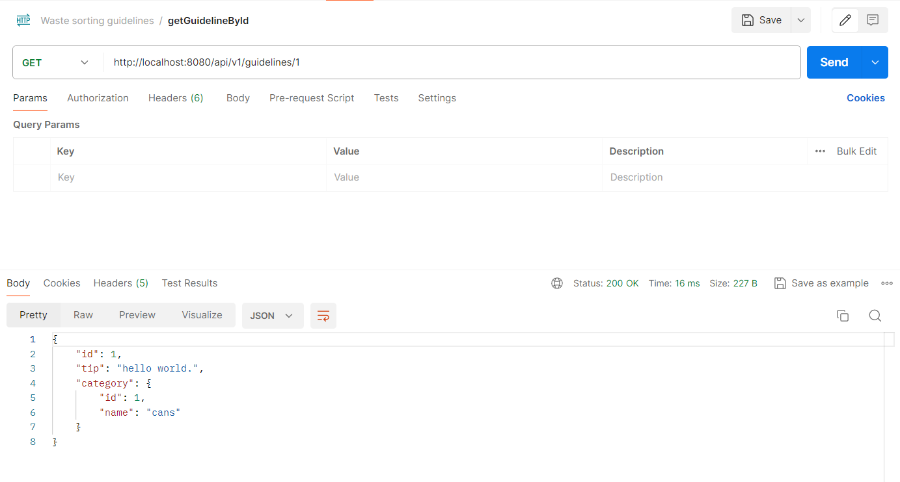

#### Update Guideline
Endpoint: http://localhost:8080/api/v1/guidelines/{guidelineId}/guideline/{categoryId}
- **Method**: PUT
- **Description**:Update a disposal guideline by its ID.
- **Response**:
  - **Status Code**: 200 OK

    	
	
#### Delete Guideline
Endpoint: http://localhost:8080/api/v1/guidelines/{id}
- **Method**: DELETE
- **Description**: Delete a disposal guideline by its ID.
- **Response**:
  - **Status Code**: 200 OK

    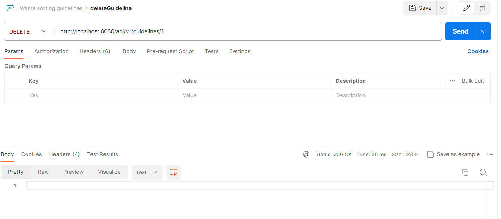	
	

## Recycling Tips Endpoints

#### Add tip endpoint
Endpoint: http://localhost:8080/api/v1/tips/{id}
- **Method**: POST
- **Description**: Add a new recycling tip.
- **Response**:
  - **Status Code**: 200 OK

    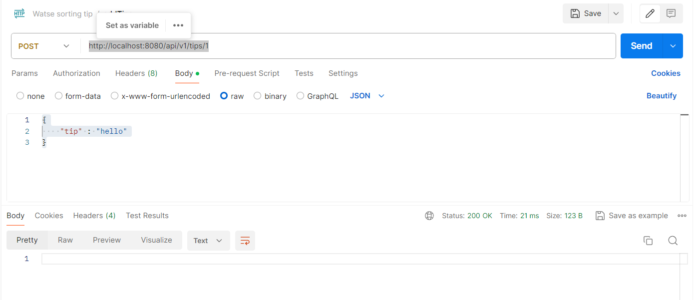

#### List All Tips
Endpoint: http://localhost:8080/api/v1/tips
- **Method**: GET
- **Description**: get all recycling tips.
- **Response**:
  - **Status Code**: 200 OK

    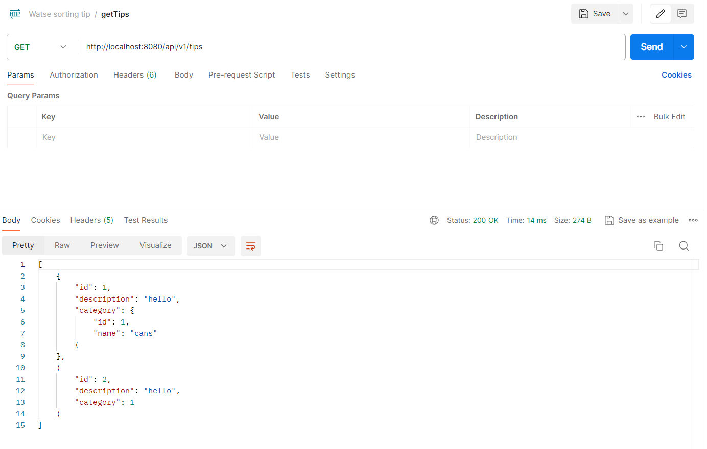
	
#### Get Tip by ID
Endpoint: http://localhost:8080/api/v1/tips/{id}
- **Method**: GET
- **Description**:Retrieve a recycling tip by its ID.
- **Response**:
  - **Status Code**: 200 OK

    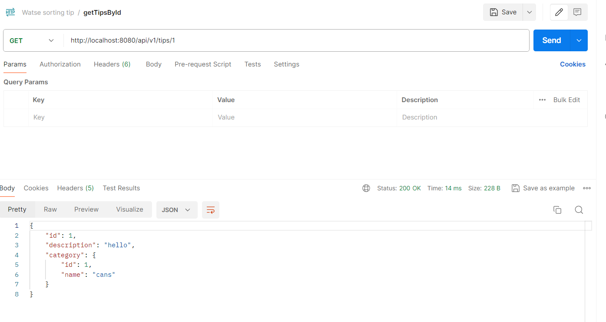

#### Update Tip
Endpoint: http://localhost:8080/api/v1/tips/{tipid}/tip/{categoryId}
- **Method**: PUT
- **Description**: Update a recycling tip by its ID.
- **Response**:
  - **Status Code**: 200 OK

    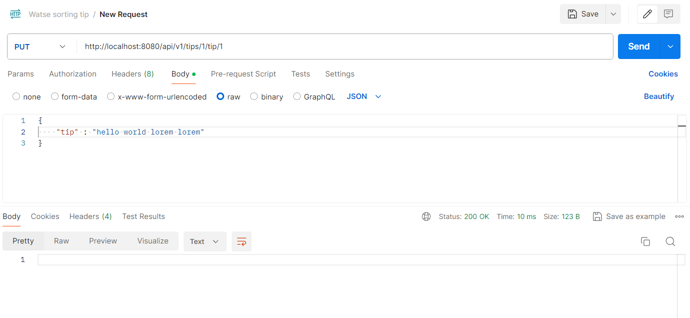	
	
#### Delete Tip
Endpoint: http://localhost:8080/api/v1/tips/{id}
- **Method**: DELETE
- **Description**:delete recycling tip by id.
- **Response**:
  - **Status Code**: 200 OK

    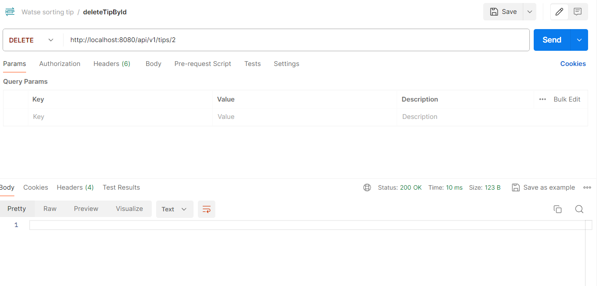	